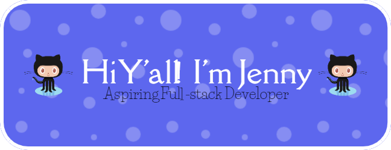

Hello! 👋 I'm a seasoned Analyst with over 11 years of experience in the public sector. I am an aspiring Full-stack Developer, with a strong foundation in Python, HTML, CSS, and JS, and have successfully launched two web applications.

I'm passionate about continuous learning and professional development, and I'm always looking for new ways to expand my skill set and stay on the cutting edge of technology.

## 💫 Little Bit More About Me

🔭 I'm currently working on www.Designai.us and WeatherSense

🌱 I'm currently learning Django

💬 Ask me about Python, Flask, OpenAi APIs

## 💻 Skills

  Python
  

  

  Flask

    

  Django

  

  SQL

    

  C

  

  COBOL
  

    

  CICS
  

  

  PostgreSQL  

  MongoDB

  HTML

  CSS

  JavaScript

  Being Awesome 👋

## 👥 Connect With Me

## 🌟 Github Badges

## 🏆 GitHub Trophies

## 📊 Github Status
